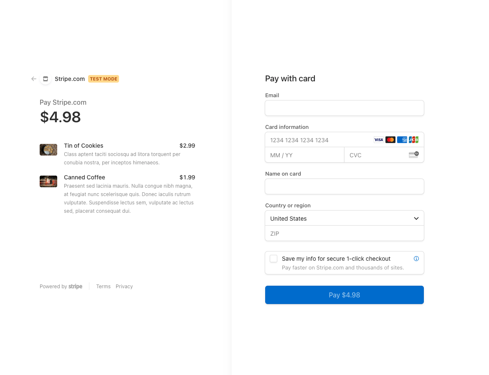

# Redux Store

[Click to View the Book Search Engine ](https://bvanburen-redux-store.herokuapp.com/)

---
[](https://opensource.org/licenses/MIT)

## Table of Contents:
- [Description](#description)
- [Installation](#installation)
- [Technologies](#technologies)
- [Usage](#usage)
- [Testing](#testing)
- [Screenshots](#screenshots)
- [Additional-Info](#additional-info)

---

## Description:

This application will allow user to shop at an online store. The code for this application was refactored to include Redux alongside react. On the application, the user will be able to browse all the products, or filter by specific category, as well as, being able to add the item to their cart. The user is allowed to add as many items to their cart as they please, but cannot check out unless they either create an account or login to their existing account. The application features sign-up and login portals, and also features a connection to Stripe. Stripe will allow the user to checkout and pay for their items via their chosen form of online payment. 

## Technologies:
```
- Javascript
- Node
- Mongo DB
- Mongoose
- Express
- MongoAtlas
- Graphql
- Apollo
- Redux
```

---

## Installation: 

To use this app, first one must clone the repo. Once, cloned, open the code in their coding platform of choice. Then open an integrated terminal at the root directory of the project and run `npm i`. This will install all the dependencies needed for the application to run correctly. 


```
npm i
npm run seed
npm start
```

---

## Usage: 

The usage of this app was to learn how to refactor code to include redux alongside react. 


---

## Testing:

This app has been internally tested by the developer for errors and bugs, and their are a few built in tests in the files that pass with the given code. 

---

## Screenshots:




---

## Additional Info:
- Github: [bvanburenwx](https://github.com/bvanburenwx)
- Email: bvanburenwx@gmail.com